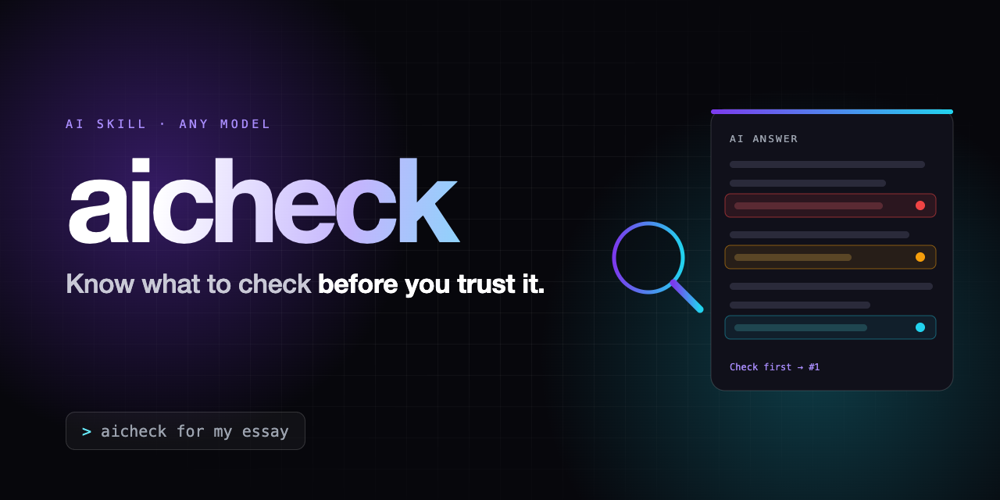

<p align="center"></p>

# aicheck

Know what to check before you trust an AI answer. Start a message with `aicheck`:

```text
aicheck for my essay
```

The assistant reviews the answer (the one you paste, or its own previous reply) and lists the few claims that could be wrong, how risky each one is, and exactly where to check it. It flags risks. It never pretends to confirm them from memory.

AI answers sound equally sure when they're right and when they're wrong. `aicheck` shows you where to look.

## What you get

```text
**Checking:** three claims about remote-work productivity and burnout
**Used for:** an essay you will submit
**Stakes:** high: an invented source in a submitted essay costs marks and trust

| # | Claim                                         | Risk | Check it by                                      |
|---|-----------------------------------------------|------|--------------------------------------------------|
| 1 | HBR article "The Hybrid Paradox", 22% figure  | 🔴   | Search the exact title on hbr.org                |
| 2 | Stanford study: remote staff 13% more productive | 🔴 | Open the original 2015 paper, find the 13%       |
| 3 | "Most companies now offer hybrid work"        | 🟡   | Find one named survey with a year, or cut it     |

**Check first:** #1, because if the article doesn't exist, the paragraph has no source.
**Safe to use as-is:** nothing until #1 and #2 are checked.

Next? (check it for me / fix the answer / done)
```

Reply `check it for me` and, if your AI can browse, it checks the red rows against real sources and links them. Reply `fix the answer` to get the answer rewritten with the risky claims that are still unchecked marked `[unverified]`. See [`examples/`](examples/) for a code check, a real news summary checked before investing, and a poem it refuses to check.

## What is in this repo?

| File | Use it for |
| --- | --- |
| [`aicheck/SKILL.md`](aicheck/SKILL.md) | The complete skill, written for Claude Code. |
| [`PORTABLE.md`](PORTABLE.md) | A short, model-neutral version for custom or project instructions. |
| [`examples/`](examples/) | Worked runs: an essay with a suspicious citation, a code snippet with a silent bug, a real news summary (with `fix the answer`), and a poem. |
| [`assets/`](assets/) | The banner and its HTML source. |

## Install

### Claude Code

1. Download this repository or copy [`aicheck/SKILL.md`](aicheck/SKILL.md).
2. Put it at `~/.claude/skills/aicheck/SKILL.md` for all your projects, or at `<your-project>/.claude/skills/aicheck/SKILL.md` for one project.
3. Start a new Claude Code session, ask any factual question, then type `aicheck`.

See the [Claude Code skill documentation](https://code.claude.com/docs/en/skills) for skill locations and invocation.

### Codex

1. Download this repository or copy [`aicheck/SKILL.md`](aicheck/SKILL.md).
2. Put it at `~/.agents/skills/aicheck/SKILL.md` for personal use, or at `<your-project>/.agents/skills/aicheck/SKILL.md` for one repository.
3. Ask Codex to use the `aicheck` skill, or invoke `$aicheck`.

See the [Codex skill documentation](https://learn.chatgpt.com/docs/build-skills) for local skill locations.

### ChatGPT or another AI

1. Open [`PORTABLE.md`](PORTABLE.md) and copy the text inside its `text` block.
2. Paste it into your AI's custom instructions or project instructions.
3. Start a fresh conversation, ask something, then type `aicheck`.

## Design rules

- It flags; it doesn't confirm. Nothing is called "correct" from memory, only after a real source.
- At most seven claims, highest risk first. Three real risks beat seven padded ones.
- Every "Check it by" names a specific place and action, never "verify online".
- The use sets the stakes: a wrong date is minor in a chat and serious in a submitted essay.
- Poems, slogans and opinions have nothing to check, so it says so and stops.

## Pairs well with

- [`scope`](https://github.com/klmiing1229-a11y/scope): decide what the task is before you start.
- [`lfg-prompt-engineer`](https://github.com/klmiing1229-a11y/lfg-prompt-engineer): turn a rough request into a prompt you approve.
- `aicheck`: check the answer before you rely on it.

## Licence

MIT. See [`LICENSE`](LICENSE).
